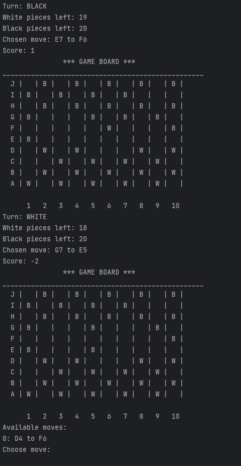

This is a simplified game of checkers. 

Rules:

1. The only available moves are diagonal. 
2. Player can move forward and backwards.
3. There are no kings, only man pieces
4. All captures are obligatory
5. If there are multiple captures available, player can choose which one to make
6. There is no rule for cyclic movement, meaning the game AI vs AI will probably last forever. 

Example screen from game:

